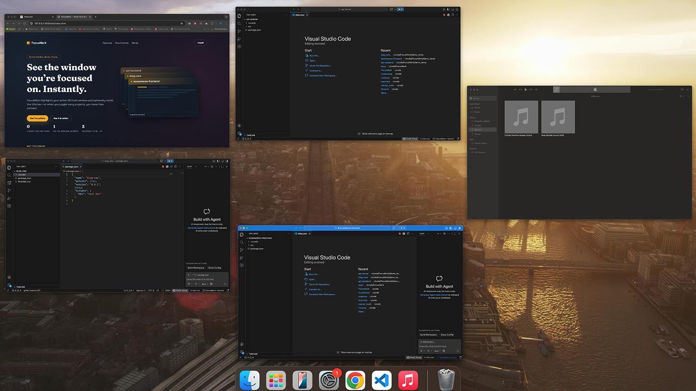
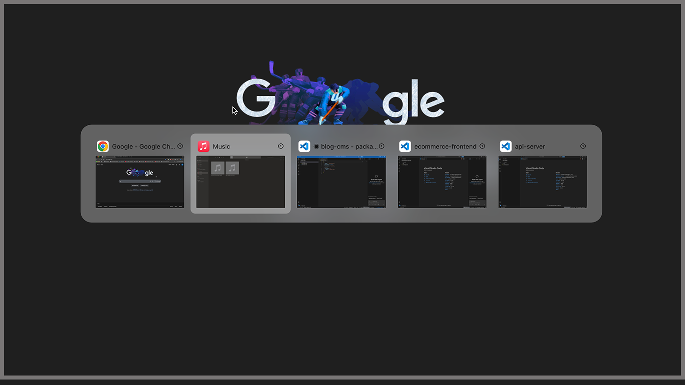

# FocusMark

FocusMark is a VS Code extension that makes the active window easy to spot when you have multiple VS Code windows open. It does this by applying a color theme to the active window and (optionally) adding a small indicator to the window title.

## Features

- Color the active window so it stands out.
- Choose from preset themes or a custom hex color.
- Optional title indicator to make the active window visible in the OS switcher.
- Full color mode toggle; title-bar-only theming is the default.

## Platform Behavior

FocusMark identifies and highlights the active **VS Code window**. It is a window-identification aid, not a window switcher.

### macOS

- `Cmd+Tab` switches apps, not VS Code windows, so FocusMark is less useful there.
- `Cmd+\`` switches between VS Code windows one-by-one; you only see one window at a time.
- Best experience: **Mission Control / App Exposé** (`Control+Down Arrow` on VS Code), where you can see all VS Code windows at once and quickly spot the active one via color/title indicator.
- Also great: **AltTab app + FocusMark**. AltTab gives a true window switcher on macOS, and FocusMark makes the last active VS Code window immediately obvious inside that switcher.

### Windows / Linux

- OS-level window switchers (for example `Alt+Tab`) typically show app windows more directly.
- FocusMark helps the active VS Code window stand out in those switchers and on the desktop, especially with many similar projects open.
- Title indicator is useful when window previews are small or truncated.

## Screenshots

## Commands

- `FocusMark: Change Theme` – pick a preset or enter a custom color.
- `FocusMark: Change Title Indicator` – pick a symbol for the window title.
- `FocusMark: Reset All Color Customizations` – restore defaults.
- `Enable FocusMark` / `Disable FocusMark`

## Settings (simplified)

Each setting below uses the `focusmark.` prefix.

- `enabled`  
  Master switch. When off, FocusMark disables colors, title indicator, and status bar.

- `enableColors`  
  When false, FocusMark disables color theming and only applies the title indicator.

- `theme`  
  Chooses the base color for the active window. Values: `auto`, `orange`, `blue`, `green`, `purple`, `custom`.

- `customColor`  
  Hex color used when `theme` is `custom`. You can set this directly or via **Custom Color** in the Change Theme command.

- `keepInactiveWindowColors`  
  When true, inactive windows keep your existing VS Code colors (no reset to defaults). When false, inactive windows reset to VS Code defaults.

- `fullColorMode`  
  When true, color the activity bar, status bar, and other UI elements. When false, only the title bar is colored.

- `activeApplyDelay`  
  Wait this many milliseconds before applying the active color (useful to smooth fast switching).

- `logLevel`  
  Controls how much FocusMark logs to the output panel. Values: `error`, `warn`, `info`, `debug`.

- `coordinationScope`  
  Controls whether FocusMark deactivates other windows globally (`global`) or only within the same workspace (`workspace`).

- `title.indicator`  
  The exact symbol or emoji used in the title when the window is active (example: `◉` or `▶`). Set to empty to disable the indicator.

## Known Limits

- VS Code does not support true per-window themes. FocusMark uses settings overrides to simulate this, so the active theme can only be applied after the extension activates.
- On very slow disks or with heavy startup load, there may be a brief delay before the active window colors apply.
